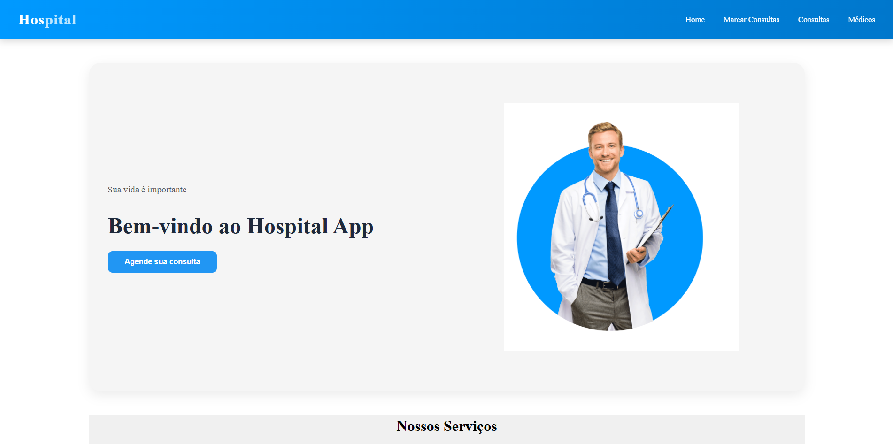

# 🏥 Hospital Landing Page

Uma aplicação full stack desenvolvida para simular o site institucional de um hospital moderno, com foco em experiência do usuário, integração entre frontend e backend e funcionalidades reais como cadastro de consultas e envio de cupons por email.

---

## ✨ Funcionalidades

* Página inicial moderna e responsiva
* Seção sobre o hospital
* Listagem de médicos e serviços
* Área de depoimentos de pacientes
* Cadastro de consultas
* Integração entre frontend e backend
* Envio automático de cupons por email
* Consumo de API REST
* Interface responsiva para diferentes dispositivos

---

## 🚀 Tecnologias Utilizadas

### Frontend

* React
* TypeScript
* CSS Modules / CSS puro
* React Icons

### Backend

* Django
* Django REST Framework
* Python

### Ferramentas

* Git & GitHub
* Postman
* Figma

---

## 📂 Estrutura do Projeto

```bash
frontend/
 ├── components/
 ├── pages/
 ├── services/
 ├── assets/

backend/
 ├── api/
 ├── models/
 ├── views/
 ├── serializers/
 └── urls/
```

---

## 🔗 Integração Frontend + Backend

O frontend consome APIs desenvolvidas no backend utilizando requisições HTTP para:

* cadastro de consultas
* listagem de dados
* envio de emails
* comunicação entre aplicação e banco de dados

---

## 📸 Preview do Projeto



---

## ⚙️ Como executar o projeto

### Frontend

```bash
cd frontend
npm install
npm run dev
```

### Backend

```bash
cd backend
pip install -r requirements.txt
python manage.py runserver
```

---

## 📚 Aprendizados

Durante o desenvolvimento deste projeto foram praticados conceitos como:

* componentização
* gerenciamento de estado
* integração entre frontend e backend
* consumo de APIs REST
* manipulação de formulários
* responsividade
* organização de código
* tratamento de requisições assíncronas

---

## 🎯 Objetivo

Este projeto foi desenvolvido com fins de estudo e aprimoramento das habilidades em desenvolvimento full stack.

---

## 👨‍💻 Autor

João Padilha

GitHub: https://github.com/JoaoPadilhaa
LinkedIn: https://www.linkedin.com/in/joaopadilha0010/
